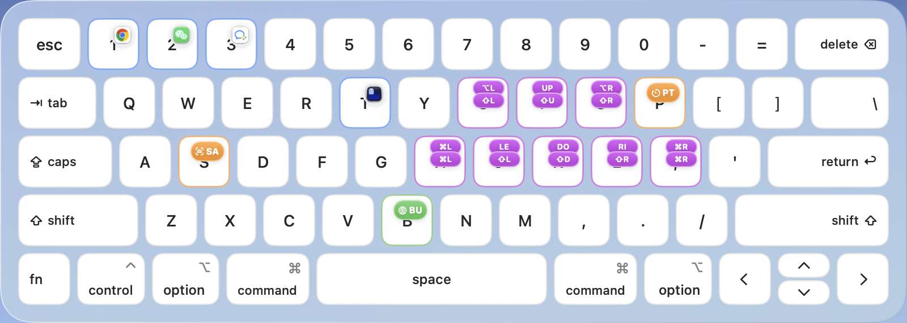
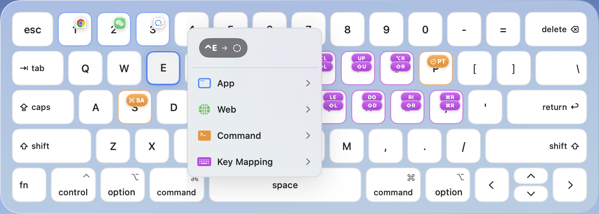
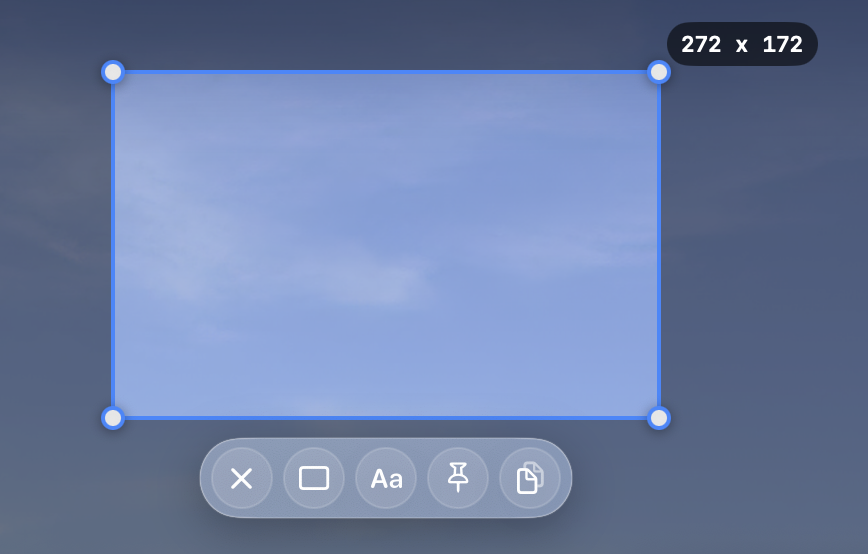

# KeyMaster / 键盘侠

[English](README.md) | 中文

KeyMaster 是一个原生 macOS 菜单栏应用，通过可视化键盘配置全局快捷键。点击一个
按键，选择动作，就能在 Mac 的任何地方触发它。



## 修饰键层

- **直接点击按键：** 默认编辑 `Control` 层。
- **按住修饰键：** 展示对应 `Control`、`Option`、`Shift`、`Command` 层的
  快捷方式，也可以同时按住多个修饰键查看组合层。
- **按住后点击：** 为当前修饰键层添加或编辑动作。

## 动作

每个快捷键可以配置四类动作：



### App

搜索 Mac 上已经安装的应用，将它绑定到快捷键后即可快速启动。

### Web

保存一个带名称的网站，通过快捷键从任何位置打开。

### Command

运行 Shell 命令。

**KeyMaster 内置工具：**

**区域截图**

框选屏幕区域，添加矩形或文字标注，然后复制结果或将截图贴在桌面上。



**番茄钟**

自动运行专注与休息周期，支持暂停、跳过、停止和通知，并在菜单栏实时显示剩余
时间。


### Key Mapping

将快捷键映射为其他按键或按键组合。例如：

- `Control + I/J/K/L` → 上、左、下、右方向键。
- `Control + Shift + I/J/K/L` → 对应方向的文本选择。

该布局可减少手指在主键区与方向键区之间的移动。

## 配置迁移

右键点击 KeyMaster 菜单栏图标，可以导入或导出全部快捷键和动作历史。

## 环境要求

- macOS 15.0 或更新版本。
- 使用全局快捷键需要辅助功能和输入监控权限。

## 从源码构建

安装 [XcodeGen](https://github.com/yonaskolb/XcodeGen)，然后运行：

```sh
brew install xcodegen
./scripts/dev-run.sh
```

`dev-run.sh` 会生成 Xcode 工程、构建 KeyMaster，并将开发版本安装到
`/Applications/KeyMaster.app`。

更多信息：[架构说明](docs/ARCHITECTURE.md) · [路线图](docs/ROADMAP.md)
